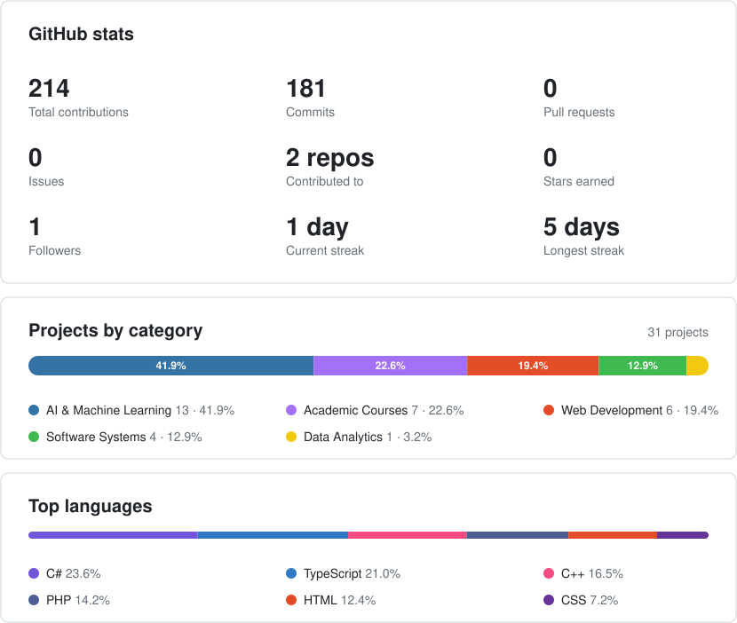

<!-- Animated header generated by .github/scripts/generate_header.py (edit roles in stats_config.json) -->
<h1 align="center">
  <picture>
    <source media="(prefers-color-scheme: dark)" srcset="assets/header-dark.svg">
    
  </picture>
</h1>

### Computer Science Enthusiast | Software Developer

I am Saikot, a Computer Science enthusiast working across C#, Python, PHP, and web technologies. I enjoy building practical systems — from assignment and blood donation management platforms to decision-support tools — and I'm always exploring new frameworks and ideas.

## Skills:

<table>
<tr>
  <td width="50%" valign="top">
    <h3>Programming Languages</h3>
    

      
      
      
      
    

    <h3>Frontend Development</h3>
    

      
      
      
    

    <h3>Backend Development</h3>
    

      
      
    

  </td>
  <td width="50%" valign="top">
    <h3>Databases</h3>
    

      
      
      
      
    

    <h3>Deployment &amp; Hosting</h3>
    

      
      
      
    

    <h3>Software &amp; Tools</h3>
    

      
      
      
    

  </td>
</tr>
</table>

## Connect

- 📫 How to reach me: md.saikot.hossainn@example.com <!-- REPLACE WITH YOUR EMAIL -->
- 💻 Here is my [Personal Portfolio](https://mdsaikothossain.vercel.app/) <!-- REPLACE WITH YOUR PORTFOLIO LINK -->
- 🔗 [LinkedIn](https://www.linkedin.com/in/md-saikot-hossain-b66237256/) <!-- REPLACE WITH YOUR LINKEDIN LINK -->

#### *Currently looking for Software Engineer / Machine Learning Engineer roles* <!-- REPLACE OR REMOVE -->

- Studying / graduated from **American International University-Bangladesh** <!-- REPLACE WITH YOUR UNIVERSITY -->
- Currently working on projects involving C#, Python, and Agentic AI systems.

## Pinned Projects

1. **[AssignmentSystem](https://github.com/MrThalamus/AssignmentSystem)** — A system for managing and tracking assignments. `C#`
2. **[Zero_Hunger](https://github.com/MrThalamus/Zero_Hunger)** — A project tackling food security challenges. `C#`
3. **[Blood-Donation-Management-System](https://github.com/MrThalamus/Blood-Donation-Management-System)** — A platform for coordinating blood donations. `HTML`
4. **[Used-Car-Purchase-Decision-Support-System](https://github.com/MrThalamus/Used-Car-Purchase-Decision-Support-System)** — A decision-support tool for used car purchases. `Python`
5. **[AgriLand-Ecosystem](https://github.com/MrThalamus/AgriLand-Ecosystem)** — An ecosystem project for agriculture and land management. `PHP`

## Connecting with

  
  
  <!-- REPLACE LINKEDIN URL ABOVE -->

### GitHub Stats

<!-- Generated every 6 hours by .github/workflows/update-stats.yml -->

  <picture>
    <source media="(prefers-color-scheme: dark)" srcset="assets/github-stats-dark.svg">
    
  </picture>

<i>Thanks for stopping by! ⭐ Feel free to explore my repositories.</i>

